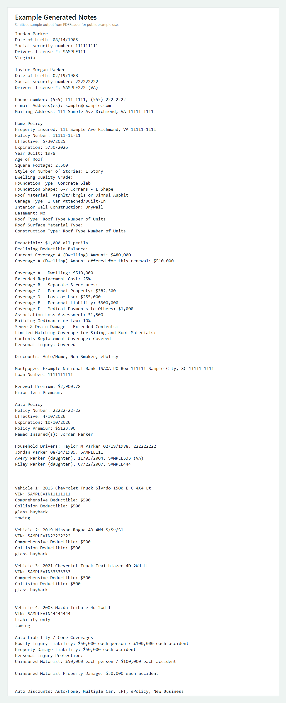

# PDFReader

`PDFReader` is a Python workflow automation tool that converts Farmers-style insurance PDF packets into structured plain-text notes.



It was built to reduce repetitive manual review work by:

- finding the right customer PDFs automatically
- extracting policy details from Home, Auto, Condo, and Renters documents
- generating consistent notes that are ready to reuse in downstream workflows
- preserving customer policy data in a structured text format for CRM intake and recordkeeping

This is not a generic PDF viewer. It is a specialized document-processing utility for operations-heavy insurance work.

## Quick Try

If you want the fastest way to see the project work without real customer files:

```bash
python demo/run_demo.py
```

That generates a sanitized example notes file using fake policy fixtures and writes it to:

```text
demo/output/JordanParkerNotes.txt
```

## What It Does

- Matches PDFs by customer name and policy type
- Reads policy PDFs with `pypdf`
- Extracts fields like named insureds, address, policy number, effective dates, coverages, deductibles, discounts, vehicles, and premium values
- Generates note files in plain text
- Supports Home-only, Auto-only, Home + Auto, Condo, and some Renters-style documents

## Why It Exists

Reviewing policy packets by hand is repetitive and slow. This project turns that work into a repeatable CLI flow so the user can:

- reduce copy/paste work
- standardize note output
- speed up policy review
- cut down on missed details in long PDFs
- keep important customer data available in a reusable note file instead of trapped inside PDFs

## Repo Layout

`pdf-notes/scripts/find_matching_pdfs.py`

- Finds candidate PDFs in the user's `Downloads` folder using filename matching

`pdf-notes/scripts/generate_fast_notes.py`

- Main entry point
- Generates compact notes directly from matching PDFs

`pdf-notes/scripts/generate_notes.py`

- Older template-driven generator
- Useful when a specific legacy notes layout is required

`pdf-notes/references/note-format.md`

- Documents the target note style and formatting rules

## Requirements

- Python 3.10+
- `pypdf`

Install dependency:

```bash
pip install pypdf
```

## Expected File Naming

The matching logic expects PDFs in `Downloads` with names like:

- `LauraFolloHome.pdf`
- `LauraFolloAuto.pdf`
- `JordanParkerAuto2.pdf`
- `TaylorBrooksCondo2.pdf`
- `JaneDoeRenters.pdf`

## Usage

Find matching PDFs:

```bash
python pdf-notes/scripts/find_matching_pdfs.py "Jordan Parker"
```

Generate compact notes:

```bash
python pdf-notes/scripts/generate_fast_notes.py "Jordan Parker"
```

Generate notes with the older template-based flow:

```bash
python pdf-notes/scripts/generate_notes.py "Jordan Parker"
```

By default, output note files are written to the user's `Downloads` folder.

## Easy Demo For Reviewers

This repo also includes a safe demo path so someone can evaluate the notes-generation workflow without using real customer PDFs.

Run:

```bash
python demo/run_demo.py
```

That generates:

```text
demo/output/JordanParkerNotes.txt
```

The demo uses fake customer fixtures and is intended to make the project easier to review for hiring or portfolio purposes.

Example assets included in the repo:

- `demo/examples/CustomerNotesExample.txt`
- `demo/examples/notes-example.png`

## Example Workflow

1. Save one or more policy PDFs to `Downloads`
2. Run the matcher or generator with the customer name
3. Review the generated `.txt` output
4. Use the note file as a structured summary instead of re-reading the full packet
5. Save or paste the generated text into a customer profile in a CRM workflow

## Output

The generated note files are plain text and are meant to be easy to copy into an existing workflow. In practice, the output serves two purposes:

- summarize policy packets for quick review
- retain important customer and policy data in a format that can be saved into a CRM profile created during intake or servicing

Depending on the source PDFs, output may include:

- insured names
- email and mailing address
- property details
- policy numbers and dates
- coverage and deductible summaries
- discounts
- vehicle details
- premium values

## Current Strengths

- Fast for repetitive document-review work
- Focused on real policy PDFs instead of toy examples
- Handles multiple policy types in one workflow
- Produces consistent notes with minimal manual cleanup
- Built around a real business use case, not a demo-only parser

## Limitations

- Built around Farmers-style document structure and naming conventions
- Relies heavily on text extraction and regex parsing
- Not intended for arbitrary PDFs
- May need updates when carrier layouts change

## Privacy

This project is designed to work with insurance documents. Do not commit customer PDFs, generated notes, credentials, or other sensitive data.

The repo currently ignores generated note output and local cache files.

## Status

This is an active workflow automation project and is best described as a specialized PDF-to-notes utility for insurance operations.
